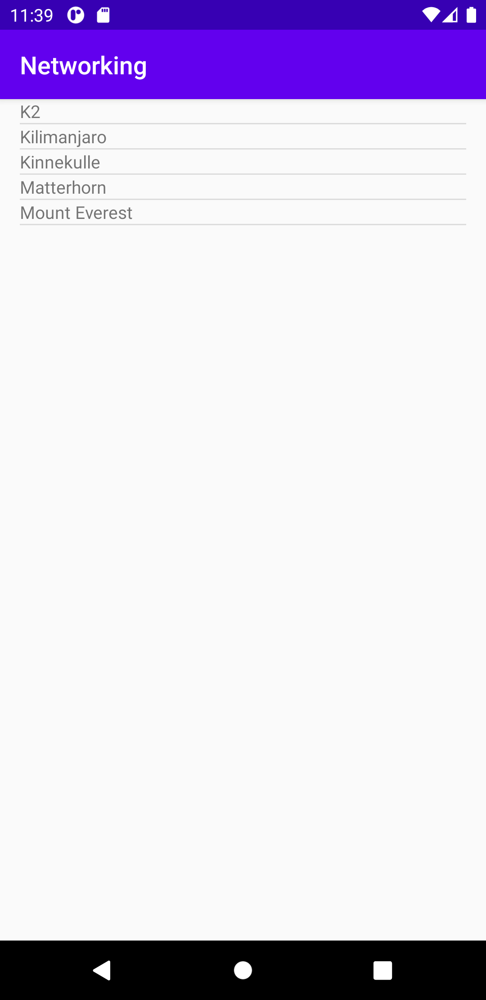
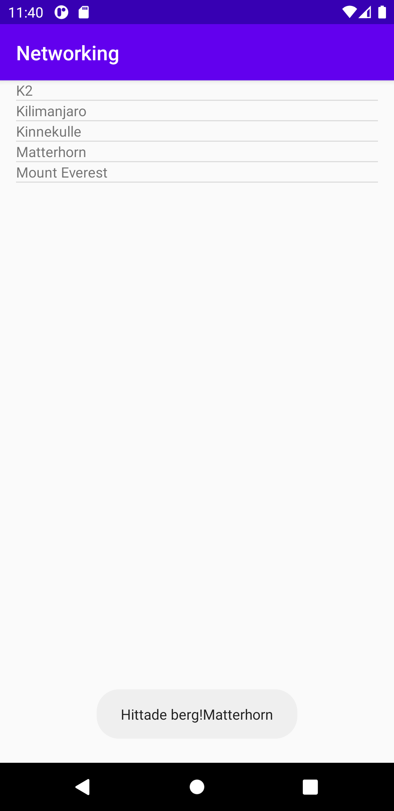

# Rapport för inlämning 6

**Networking**

- Add a `ListView` to your layout
En ListView lades till i xml layoutfilen activity_main. Koden som användes var denna:
```
    <ListView
        android:id="@+id/listView"
        android:layout_width="match_parent"
        android:layout_height="match_parent"
        android:text="Hello!">
    </ListView>
```

- Add a `ArrayList<Mountain>` as a member variable in your activity, Add a `ArrayAdapter<Mountain>` as a member variable in your activity
I java klassen MainActivity lades en ArrayList<Mountain> och en ArrayAdapter<Mountain>. Det gjordes genom genom att lägga in detta kodstycket:
```
 private ArrayList<Mountain> arrayMountain;
 private ArrayAdapter<Mountain> adapter;
```

- Use `JsonTask` to fetch data from our json web service
Koden för `JsonTask` hämtades från lenasys. Den lades till utanför alla metoder, nedanför onCreate i MainActivity. Datan fanns representerad i en länk som likaså hittades på lenasys. 
Datan lästes in genom att addera följande kod inuti metoden onCreate:`new JsonTask().execute("https://wwwlab.iit.his.se/brom/kurser/mobilprog/dbservice/admin/getdataasjson.php?type=brom");`

- Add items to your list of mountains by parsing the json data Hint: use `adapter.notifyDataSetChanged();` from within `onPostExecute(String json)` to notify the adapter that the content of the ArrayList has been updated.
Ett bibliotek skulle läggas in för att kunna läsa av gson data. Det gjordes genom file -> project structure -> dependencies -> app.
När detta gjordes kunde biblioteket synas längst upp bland importerade filer i MainActivity.`import com.google.gson.Gson;`
 Genom att lägga till `adapter.notifyDataSetChanged();` i metoden onPostExecute kunde uppdatateringar av arraylisten uppmärksammas och ny data kunde föras in. 
 ```
@Override
        protected void onPostExecute(String json) {
            Log.d("DATA", json);

            Gson gson = new Gson();
            Mountain[] tempmountains = gson.fromJson(json, Mountain[].class);

            for (int i = 0; i <tempmountains.length; i++) {
                Mountain m = tempmountains[i];
                Log.d("DATA", m.toString());


                arrayMountain.add(m);

            }

            adapter.notifyDataSetChanged();

        }
```

- Display the names of the mountains in the `ListView` Hint: override `toString()` in your Mountain class samt Display Mountain name and 2 other properties as a Toast View.                                                                                                      
Genom att lägga till kodstycket nedanför möjliggjordes det för appen att hämta hem bergens namn:
```
  public String toString() {
        return name;
    }
```
För att sen kunna skriva ut datan som innehöll olika properties för bergen bland annat namn behöves detta kodstycket i metoden onItemClick:
```
public void onItemClick(AdapterView<?> parent, View view, int position, long id) {
                    //Här visar jag genom adapter. andra properties ex höjd osv
                    String name = arrayMountain.get(position).getName();
                    String type = arrayMountain.get(position).getType();
                    String location = arrayMountain.get(position).getLocation();
                    String sentence = name + " <<<< " + type + "<<<<< " +location ;
```






**OBS Bild 4 är den aktuella bilden på toasten, min dator är så seg så jag får tyvärr inte till en bättre screenshot**

